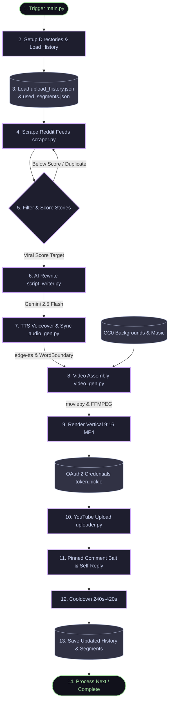

# YT Automater — Project Context & System Memory

This file serves as the permanent system memory and developer context for the **YT Automater** project. It documents the core objectives, retention philosophies, hard rules, styling specifications, pipeline flow architecture, recent structural optimizations, and critical deployment watch-outs.

---

## 🎯 1. Core Goal & Philosophy
A fully automated, 100% free YouTube Shorts pipeline that posts vertical high-retention shorts to maximize views and earn revenue through YouTube monetization.

### Core Retention Philosophy (ADHD-Proof Design)
*   **Hook Strategy (Climax First):** Open with the most shocking/embarrassing/curious moment (First 2 seconds). Good opener: *"She sold my car while I was sleeping."* The headline is spoken first in voiceover, creating a *"Wait, how did this happen?"* reaction.
*   **Story Structure:** Hook ➔ Setup ➔ Escalation ➔ Cliffhanger (NO resolution). Ending the story abruptly on a peak cliffhanger forces rewatches, significantly boosting algorithmic retention.
*   **Dynamic Visuals:** Fast-paced satisfying motion background loops keep the eyes busy, while captions flash exactly 1 word/chunk at a time in sync with the audio (dual-channel engagement).
*   **Ambient Production:** Low-volume CC0 ambient music track mixed behind a natural narrator voice with tight silence buffers to prevent dead air.

---

## ⚖️ 2. Hard Rules (100% Free & Zero Copyright Risk)

*   **TTS:** `edge-tts` (Microsoft Azure Neural voices, free and unlimited).
*   **AI Rewriting:** Google Gemini 2.5 Flash API (Free tier: 15 requests/min, 1500 requests/day).
*   **Video Assembly:** `moviepy==1.0.3` + `ffmpeg` (Open source).
*   **Fonts:** Only SIL Open Font License or equivalent (Montserrat ExtraBold).
*   **Scraping:** Reddit public RSS feeds (Free and bypasses complex OAuth API limits).
*   **Background Videos/Music:** 100% copyright-free CC0 assets only (Pixabay/Freesound).
*   **Secrets Isolation:** `client_secret.json`, `token.pickle`, and `token_base64.txt` are strictly ignored by `.gitignore` to prevent credentials leakage.

---

## 🎨 3. Styling & Video Specifications

| Element | Specification |
|---|---|
| **Platform** | YouTube Shorts (vertical 9:16, 1080×1920) |
| **Duration** | ≤ 60 seconds (Shorts algorithmic limit) |
| **Subreddit Pool** | High-conflict subreddits (`r/pettyrevenge`, `r/tifu`, `r/AmItheAsshole`, `r/relationships`, etc.) |
| **AI Rewrite Script** | curiosity-driven, 100–115 words, Cliffhanger ending + Rotating Comment bait |
| **Voiceover** | edge-tts Neural voices (rotating pool: `Ryan`, `Aria`, `Guy`, `Christopher`, `Jenny`) at `+10%` speed rate |
| **Subtitle Font** | Montserrat ExtraBold (viral standard, SIL Open Font Licensed) |
| **Subtitle Style** | Yellow text (`#FFE000` / `'yellow'`) + black outline (`12px` stroke) + `2px` black anti-aliasing buffer |
| **Subtitle Animation** | Scale-up pop effect: `1.25x` ➔ `1.0x` in `0.07` seconds on each word chunk |
| **Subtitle Layout** | Singlecentered line, placed at `45%–60%` from top (randomized offset to bypass YouTube UI overlays) |
| **Background Loop** | Shuffled satisfying/satisfying loops with slow zoom drift (`1.0x` ➔ `1.05x`) |
| **Seamless Ending** | `0.4` second crossfade loop to blend the ending into the first frame |

---

## 📊 4. System Pipeline Flow

The bot utilizes a modular pipeline flow from scraping down to publishing:



---

## 🛠️ 5. Recent System Optimizations & Bug Fixes

During recent pipeline testing, several critical bugs were patched to maintain visual quality and automated stability:

### 1. Local Test Video Mode
*   Added local review flags `--test-video` and `--test-story-file` to `main.py`. This bypasses Reddit scraping and YouTube uploads, rendering a test video from a static story directly into `videos_to_upload/` with a second-level timestamp for QA.

### 2. Shuffled Backgrounds & Persistent Caching (Variety Fix)
*   **The Bug:** The segment picker checked `if free_time > best_free_time:`. Because `background.mp4` (Minecraft gameplay) is a giant file (~300MB), its remaining duration always beat the shorter stylized loops, keeping the bot stuck on a single clip.
*   **The Fix:** Updated `pick_background_segment` in `background_manager.py` to compile all valid candidate clips (excluding fallback files), shuffle them, and pick one randomly.
*   **GitHub Persistent Cache:** We moved `used_segments.json` to the project root and added a mutable, writeable cache block in `.github/workflows/youtube_bot.yml` matching `upload_history.json`. Segment tracking now successfully persists across distinct Actions executions.

### 3. Linux Text Outline Anti-Aliasing (Jagged Yellow Captions)
*   **The Bug:** On Ubuntu Linux (GitHub Actions), ImageMagick cannot resolve raw `.ttf` file paths, falling back to thin generic fonts. Furthermore, text rendering on transparent backgrounds on Linux introduces subpixel boundaries, causing the yellow text edges to appear jagged and pixelated.
*   **The Fix:**
    *   **Ubuntu Registry:** The workflow now copies the font to `/usr/share/fonts/truetype/montserrat` and refreshes the cache (`sudo fc-cache -f -v`).
    *   **Actions Detector:** `video_gen.py` checks `if os.environ.get("GITHUB_ACTIONS") == "true":` and loads the font globally by family name `"Montserrat-ExtraBold"`.
    *   **Smooth Outline Buffer:** Added a thin `2px` black stroke (`stroke_color='black', stroke_width=2`) to the foreground yellow `TextClip`. This thin outline completely absorbs the jagged transparency fringes, creating beautifully smoothed captions.

### 4. MoviePy + NumPy Stacking `TypeError` (Silence Trim Fix)
*   **The Bug:** MoviePy 1.0.3's `audio_clip.to_soundarray()` raises a `TypeError` on modern NumPy versions (1.24+ and 2.x) because it attempts to pass a generator to `np.vstack`. This silently crashed `trim_audio_silence` on every execution.
*   **The Effect:** Videos were rendered with `0.5s` to `1.5s` of dead silence at the end, breaking the seamless loop retention and hurting search algorithms.
*   **The Fix:** Replaced `to_soundarray()` with a robust sequence-stacking routine:
    ```python
    buffersize = int(fps * 0.1)  # 100ms chunks
    chunks = []
    for chunk in audio_clip.iter_chunks(fps=fps, chunksize=buffersize, quantize=True, nbytes=2):
        chunks.append(chunk)
    audio_array = np.vstack(chunks) if audio_clip.nchannels > 1 else np.hstack(chunks)
    ```
    This completely restores the abrupt ending and infinite-loop crossfade transition.

### 5. Active Voice Pool Swap
*   **The Bug:** Microsoft deprecated the `en-US-DavisNeural` voice, causing a `No audio was received` network crash in the pipeline.
*   **The Fix:** Replaced the voice inside `audio_gen.py`'s `VOICE_POOL` with the active deep male voice `en-US-ChristopherNeural`.

---

## 🏛️ 6. Inspirational Content Pipeline — "Dark Stoic" Shorts

### Content Strategy (2+1 Daily Schedule)
The channel uploads **3 videos per day**:
- **Morning (9:30 AM IST):** Shocking Story Short (Reddit → AI Rewrite → TTS)
- **Afternoon (12:30 PM IST):** Shocking Story Short
- **Evening (7:00 PM IST):** Dark Stoic Motivational Short (AI-generated Stoic philosophy)

### Inspirational Pipeline Architecture
Unlike the story pipeline (which scrapes Reddit), the inspiration pipeline is **100% AI-generated**:
1. `inspiration_writer.py` selects a theme from a bank of 30 rotating Stoic principles
2. Gemini 2.5 Flash generates a script with Hook → Lesson → Action structure (80-100 words)
3. `audio_gen.py` uses the **Inspiration Voice Pool** (deep male voices at `+5%` rate)
4. `video_gen.py` renders with the **Inspiration Style** (white text, calmer zoom)
5. `main.py` routes to `create_inspirational_short()` when `--content-type inspiration`

### Visual Style Differences (Story vs. Inspiration)

| Property | Story | Inspiration |
|---|---|---|
| **Text Color** | Yellow (`#FFE000`) | White (`#FFFFFF`) |
| **Stroke Width** | 12px | 8px |
| **Font Size** | 95px | 80px |
| **Text Position** | Random 45-60% | Centered 50% |
| **Pop Animation** | 1.25x → 1.0x | 1.15x → 1.0x |
| **Zoom Drift** | 1.03-1.07x | 1.01-1.04x |
| **Music Volume** | 12% | 15% |
| **Music Source** | `assets/music/` | `assets/inspiration_music/` |
| **Background Source** | `assets/` | `assets/inspiration_bg/` |
| **YouTube Category** | 24 (Entertainment) | 22 (People & Blogs) |
| **Voices** | Full pool (5 voices) | Deep males only (3 voices) |

### Theme Rotation
- 30 Stoic themes rotate automatically (Silence is Power, Amor Fati, Memento Mori, etc.)
- Upload history tracks `stoic_theme` per video to avoid repeating themes within a 30-video window
- Philosophers referenced: Marcus Aurelius, Seneca, Epictetus

### Assets
- **Backgrounds** (`assets/inspiration_bg/`): Dark cinematic — stormy clouds, fog forests, fire embers, rain windows, mountain peaks
- **Music** (`assets/inspiration_music/`): Dark ambient, cinematic tension, emotional piano
- All CC0 from Pixabay (free for commercial use)

### CI/CD Routing
The GitHub Actions workflow auto-detects content type from the cron schedule:
- **UTC hour < 13** → `--content-type story`
- **UTC hour ≥ 13** → `--content-type inspiration`
- **Manual trigger** → User selects content type from dropdown

---

## ⚠️ 7. Deployment & Runtime Guidelines

### Google Cloud OAuth Token Expiry (The 7-Day Crash)
*   **The Danger:** If your GCP project's publishing status is set to **"Testing"**, all OAuth2 refresh tokens expire after exactly 7 days. Your GitHub Actions pipeline will fail to authenticate after 1 week.
*   **The Mitigation:** Go to your **GCP Console** ➔ **APIs & Services** ➔ **OAuth consent screen** and click the **"Publish App"** button to move the project to **"In Production"**. This makes your refresh token permanent.

### Pillow Dependency Version Pinning
*   **The Danger:** MoviePy 1.0.3 utilizes rendering methods that were deprecated and completely removed in Pillow 10.x+. 
*   **The Mitigation:** You **must** keep Pillow pinned to `9.5.0` inside `requirements.txt` to avoid text compilation crashes during video rendering.
