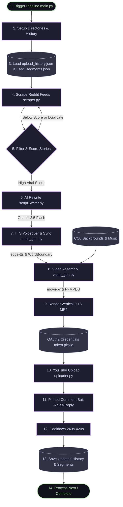

# YouTube Shorts Automater — System Memory & Developer Guide

This document serves as the permanent developer memory map and system guide for the **YT Automater** project. It outlines the core architectural components, pipeline flows, recent structural optimizations, deployment instructions, and critical runtime warnings.

---

## 📊 1. System Pipeline Architecture

The bot runs on a fully automated, copyright-free pipeline that converts Reddit stories into viral, high-retention 9:16 vertical Shorts.



---

## 🗃️ 2. Module Mapping & Responsibilities

| Module | Core Responsibility | Dependencies / Key APIs | Key Inputs ➔ Outputs |
|---|---|---|---|
| **`main.py`** | Pipeline coordinator, CLI argument parser, directory builder, and scheduling engine. | `datetime`, `argparse`, `shutil` | System Args ➔ Executed Video Generation & History Logs |
| **`scraper.py`** | Scrapes popular, non-sensitive posts from subreddits via RSS feeds; Restructures content to put hook first. | `requests`, `xml.etree.ElementTree` | Reddit RSS ➔ Raw Title, restructed Body, & Subreddit |
| **`script_writer.py`** | Rewrites raw text into punchy viral Shorts scripts (100–115 words) with an all-caps title and a comment-bait ending. | Google Gemini 2.5 Flash API | Raw text ➔ Viral JSON (`headline`, `script`, optional `script_part2`) |
| **`audio_gen.py`** | Generates TTS narration and captures exact word-level timing offsets for high-accuracy karaoke subtitles. | `edge-tts` (Microsoft Neural Voices) | Text Script ➔ `audio.mp3` & word-level `subs.srt` |
| **`video_gen.py`** | Handles composite rendering: trims audio trailing silence, overlays text pop-animations, crops 9:16 vertical BG, and loops audio/video. | `moviepy`, `ffmpeg`, `numpy`, ImageMagick | Audio, SRT, Background Video, Music ➔ Compiled vertical `.mp4` Short |
| **`background_manager.py`** | Prevents video segment reuse across generated shorts, dynamically managing available background loops. | `moviepy`, `random`, `json` | Required Duration ➔ Selected Video Path & `start_time` offset |
| **`uploader.py`** | Uploads the Short to YouTube, generates highly-targeted metadata, and posts engagement comment bait with self-replies. | YouTube Data API v3 | Rendered `.mp4`, Title, Description, Tags ➔ Pinned Pushes |
| **`youtube_api.py`** | Manages OAuth2 client authentication, refreshing expired tokens, and credentials bootstrapping on GitHub Actions. | `google-auth-oauthlib`, `pickle` | `client_secret.json` ➔ Google API client object |
| **`download_backgrounds.py`** | Bulk-downloads handpicked satisfying, looping vertical videos from Pixabay's CDN to seed the assets cache. | `requests`, `urllib` | Pixabay CDN URLs ➔ 10 `.mp4` motion background loops |
| **`download_music.py`** | Downloads ambient, suspenseful, royalty-free CC0 background music tracks to seed the assets cache. | `urllib.request` | Freesound/Pixabay direct URLs ➔ `assets/music/*.mp3` |

---

## 🛠️ 3. Critical Improvements & Core Refactoring

During our recent engineering iterations, several highly critical bugs were successfully resolved to guarantee system variety, execution stability, and visual premium quality.

### 1. Persistent Tracking & Background Video Variety
*   **The Bug:** The background video manager originally checked: `if free_time > best_free_time:`. Because `background.mp4` (the Minecraft gameplay clip) is a massive file (~300MB), its remaining free time was always the largest. This caused it to be chosen **100% of the time**, rendering the other 10 beautiful motion backgrounds inactive.
*   **The Refactor:** Re-implemented `pick_background_segment` in `background_manager.py` to compile a list of all valid candidate background video clips (excluding `background_small.mp4` as a fallback only). The script now **shuffles and randomly picks** a candidate video, providing outstanding visual variety.
*   **GitHub Persistent Cache:** We moved `used_segments.json` to the project root and added a writeable, mutable cache step inside `.github/workflows/youtube_bot.yml` matching `upload_history.json`. This ensures that segment tracking successfully persists across different Action runs, preventing the reuse of the same cuts.

### 2. Linux Foreground Text Aliasing (Jagged Yellow Caption Borders)
*   **The Bug:** On Ubuntu Linux (GitHub Actions), ImageMagick fails to resolve raw `.ttf` file paths passed to `TextClip`, falling back to generic ugly serif fonts. Furthermore, text rendering against transparent backgrounds on Linux introduces subpixel aliasing borders, causing the yellow text edges to appear jagged and pixelated.
*   **The Refactor:**
    *   **System Registration:** In the GitHub Action workflow, we globally register the Montserrat font inside `/usr/share/fonts/truetype/montserrat` and refresh the cache via `sudo fc-cache -f -v`.
    *   **Actions Detector:** Inside `video_gen.py`, we check `if os.environ.get("GITHUB_ACTIONS") == "true":` and load the font globally by its family name `"Montserrat-ExtraBold"`.
    *   **Antialiasing Buffer:** We added a very thin `2px` black stroke (`stroke_color='black', stroke_width=2`) to the foreground yellow `TextClip`. This thin outline acts as a subpixel anti-aliasing buffer, completely absorbing the jagged transparent fringes without hurting font readability.

### 3. MoviePy + NumPy Audio Stacking `TypeError`
*   **The Bug:** MoviePy's built-in `audio_clip.to_soundarray()` fails on modern NumPy versions (1.24+ and 2.x) because it passes a generator directly to `np.vstack`, causing a severe `TypeError`. This silently crashed `trim_audio_silence` on every run, skipping silence trimming entirely.
*   **The Effect:** Videos were rendered with `0.5s` to `1.5s` of dead silence at the end, breaking the seamless infinite loop retention trick and severely hurting viewer retention metrics.
*   **The Refactor:** Rewrote the sound extraction logic to manually iterate over MoviePy's `iter_chunks` into a standard Python list (sequence type) before stacking:
    ```python
    buffersize = int(fps * 0.1)  # 100ms chunks
    chunks = []
    for chunk in audio_clip.iter_chunks(fps=fps, chunksize=buffersize, quantize=True, nbytes=2):
        chunks.append(chunk)
    audio_array = np.vstack(chunks) if audio_clip.nchannels > 1 else np.hstack(chunks)
    ```
    This completely restores precision silence trimming, maintaining a tight `0.05s` abrupt loop ending.

### 4. Edge-TTS DavisNeural Voice Deprecation
*   **The Bug:** Microsoft recently deprecated and removed the `en-US-DavisNeural` voice from its edge-tts registry, causing the audio generator to fail with a `No audio was received` network error.
*   **The Refactor:** Replaced the voice inside `audio_gen.py`'s `VOICE_POOL` rotation with the active, deep authoritative male voice `en-US-ChristopherNeural`.

---

## 🚀 4. Local Test & Review Sheet

A dedicated, isolated local testing harness has been introduced to `main.py` so you can verify changes without scraping Reddit or pushing uploads to YouTube.

### Test CLI Commands:
*   **Generate local test video with default petty-revenge story:**
    ```powershell
    python main.py --test-video
    ```
*   **Generate test video with your own custom story file:**
    *(Create a text file where the first line is the title, and the rest is the body)*
    ```powershell
    python main.py --test-story-file "path/to/my_story.txt"
    ```
*   **Test with specific voice or custom background asset:**
    ```powershell
    python main.py --test-video -v "en-GB-RyanNeural" -b "assets/bg_retro_grid.mp4"
    ```

*All generated test runs are saved directly in `videos_to_upload/` with a unique, second-level timestamp for review.*

---

## ⚠️ 5. Production Watch-outs & Critical Warnings

### Google Cloud OAuth Token Expiry (The 7-Day Crash)
*   **The Danger:** When creating your Google API credentials, your GCP OAuth Consent Screen is in **"Testing"** status by default. In Testing, **Google refresh tokens expire after exactly 7 days**. After 1 week, your GitHub Action will fail to authenticate, crashing with a `google.auth.exceptions.RefreshError`.
*   **The Mitigation:** Go to your **GCP Console** ➔ **APIs & Services** ➔ **OAuth consent screen** and click **"Publish App"** to change the publishing status to **"In Production"**. This makes your refresh token permanent.

### Pillow Dependency Version Pinning
*   **The Danger:** MoviePy 1.0.3 relies heavily on drawing interfaces that were deprecated and removed in Pillow 10.0.0+. 
*   **The Mitigation:** You **must** keep Pillow pinned to `9.5.0` inside `requirements.txt` to avoid text compilation crashes during video rendering.
